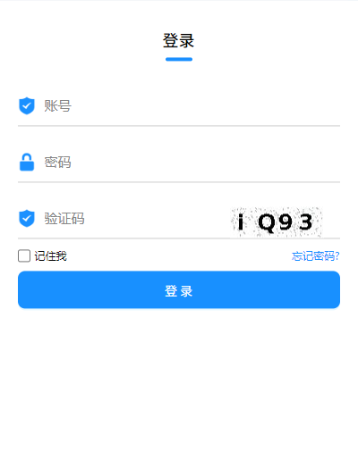
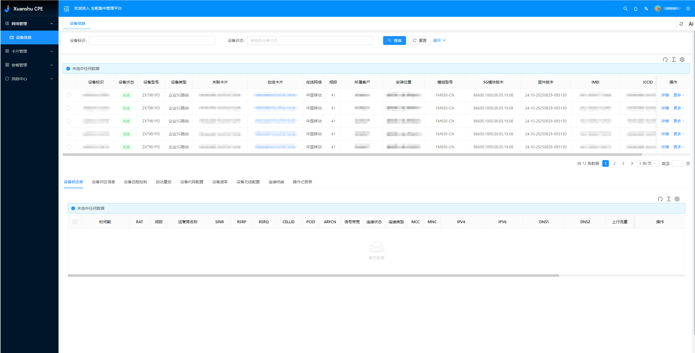
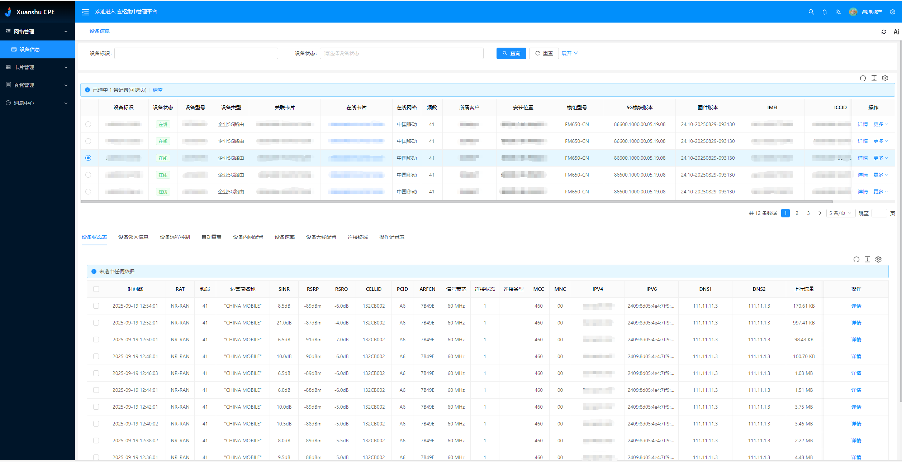
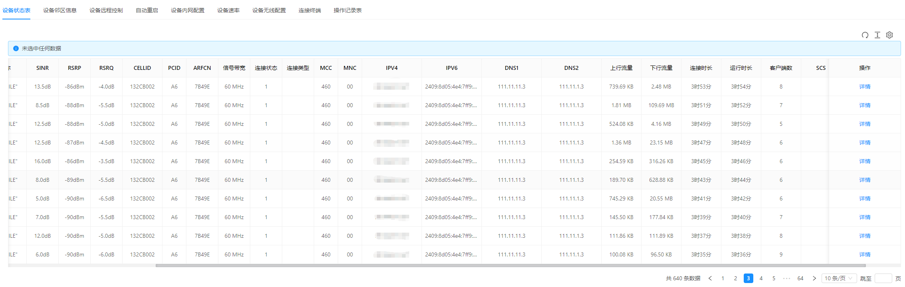
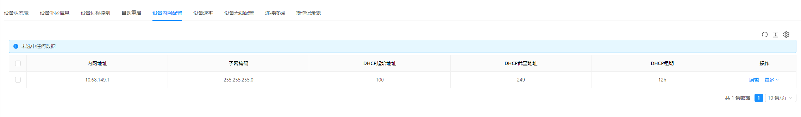
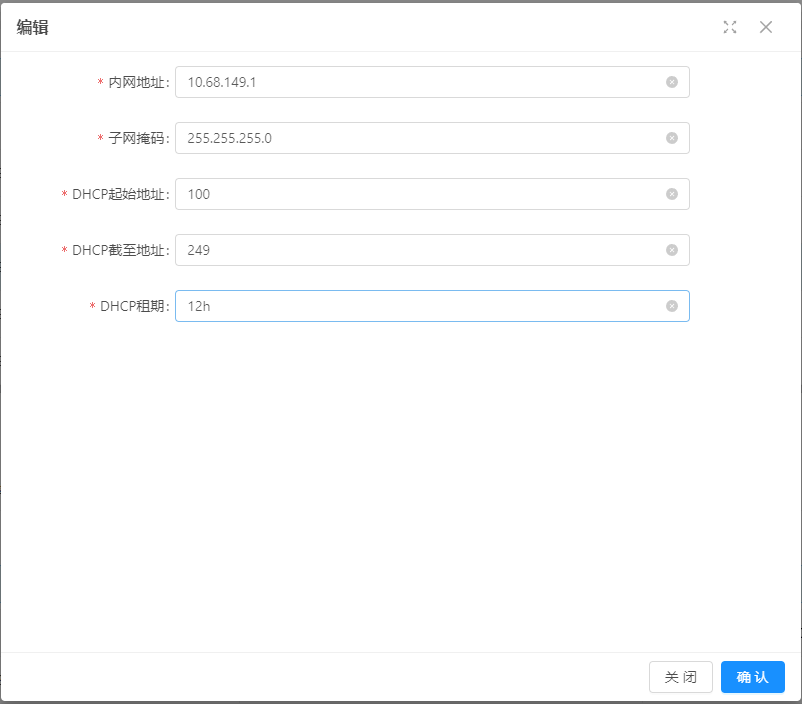
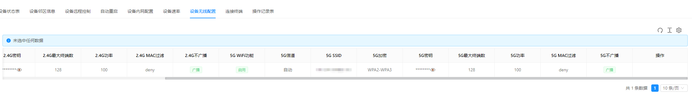
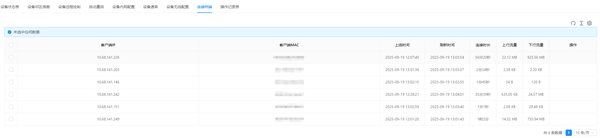
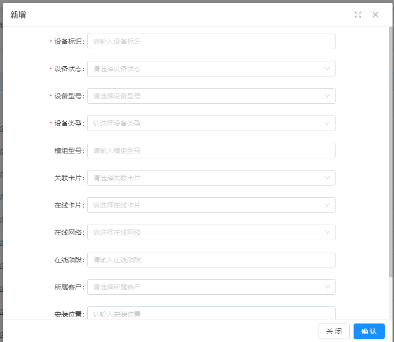

# CPE设备管理系统用户使用说明书

## 目录
- [1. 系统简介](#1-系统简介)
- [2. 快速开始](#2-快速开始)
- [3. 功能模块](#3-功能模块)
  - [3.1 设备管理](#31-设备管理)
  - [3.2 设备监控](#32-设备监控)
  - [3.3 网络配置](#33-网络配置)
  - [3.4 无线配置](#34-无线配置)
  - [3.5 客户端管理](#35-客户端管理)
  - [3.6 告警管理](#36-告警管理)
  - [3.7 卡片管理](#37-卡片管理)
- [4. 操作指南](#4-操作指南)
- [5. 常见问题](#5-常见问题)
- [6. 技术支持](#6-技术支持)

---

## 1. 系统简介

### 1.1 系统概述
CPE设备管理系统是一个专业的设备管理平台，用于集中管理和监控CPE设备。系统提供设备状态监控、远程配置、告警管理等功能，帮助您高效管理大量设备。

### 1.2 主要功能
- **设备集中管理**：统一管理所有CPE设备
- **实时状态监控**：实时查看设备运行状态
- **远程配置管理**：远程配置设备网络和无线参数
- **告警通知**：设备异常时及时通知
- **数据统计**：设备使用情况统计分析

---

## 2. 快速开始

### 2.1 系统登录
1. 打开浏览器，访问系统地址
2. 输入用户名和密码
3. 点击"登录"按钮
4. 登录成功后进入系统主界面

### 2.2 主界面介绍
系统主界面包含：
- **左侧导航菜单**：功能模块导航
- **顶部工具栏**：用户信息、系统设置
- **主工作区**：功能操作区域

---

## 3. 功能模块

### 3.1 设备管理

#### 3.1.1 设备详情
**功能说明**：查看单个设备的详细信息

**查看内容**：
- 设备基本信息
- 实时状态数据
- 配置信息
- 操作历史

**操作步骤**：
1. 在设备列表中点击"查看"按钮
2. 进入设备详情页面
3. 查看各项信息
4. 可进行配置修改

### 3.2 设备监控

#### 3.2.1 状态监控
**功能说明**：实时监控设备运行状态

**监控内容**：
- 设备在线状态
- CPU温度
- 内存使用率
- 网络连接状态
- 系统运行时间
- 客户端连接数

**操作步骤**：
1. 进入"设备管理"  "设备状态"
2. 查看实时状态数据
3. 选择时间范围查看历史数据
4. 可导出状态报表

#### 3.2.2 网络状态
**功能说明**：监控设备网络连接状态

**监控内容**：
- 公网IP地址
- 网络连接质量
- 流量使用情况
- 网络接口状态

**操作步骤**：
1. 进入"设备管理"  "网络状态"
2. 查看网络连接信息
3. 监控流量使用情况

### 3.3 网络配置

#### 3.3.1 LAN配置
**功能说明**：配置设备局域网设置

**配置项**：
- LAN IP地址
- 子网掩码
- DHCP地址池
- DHCP租期

**操作步骤**：
1. 选择要配置的设备
2. 进入"网络配置"页面
3. 修改LAN配置参数
4. 点击"保存并下发"应用配置

### 3.4 无线配置

#### 3.4.1 无线配置
**功能说明**：配置设备无线网络

**配置项**：
- 启用/禁用
- 无线信道
- SSID名称
- 无线密码
- 加密方式
- 最大连接数
- MAC地址过滤
- 信号隐藏

**操作步骤**：
1. 选择要配置的设备
2. 进入"无线配置"页面
3. 配置频段参数
4. 点击"保存并下发"应用配置

### 3.5 客户端管理

#### 3.5.1 客户端列表
**功能说明**：查看连接到设备的无线客户端

**查看内容**：
- 客户端连接状态
- 客户端IP地址
- 连接时长
- 流量使用情况
- 信号强度

**操作步骤**：
1. 进入"设备管理"  "客户端管理"
2. 选择要查看的设备
3. 查看客户端连接列表

---

## 4. 操作指南

### 4.1 设备注册（管理员）

#### 4.1.1 手动添加设备
1. 进入"设备管理"  "设备列表"
2. 点击"新增"按钮
3. 填写设备信息：
   - 设备标识（MAC地址）
   - 设备名称
   - 设备类型
   - 所属客户
   - 设备描述
4. 点击"保存"完成注册

### 4.2 设备配置

#### 4.2.1 网络配置流程
1. 选择要配置的设备
2. 进入"网络配置"页面
3. 修改网络参数
4. 点击"保存并下发"
5. 等待配置生效

#### 4.2.2 无线配置流程
1. 选择要配置的设备
2. 进入"无线配置"页面
3. 分别配置2.4G和5G参数
4. 点击"保存并下发"
5. 等待配置生效

### 4.3 设备监控

#### 4.3.1 实时监控操作
1. 进入"设备管理"  "设备状态"
2. 选择要监控的设备
3. 查看实时状态数据
4. 设置自动刷新间隔

#### 4.3.2 历史数据查询
1. 在状态监控页面选择时间范围
2. 点击"查询"按钮
3. 查看历史数据图表
4. 可导出数据报表

### 4.4 告警处理

#### 4.4.1 告警规则设置
1. 进入"告警管理"  "告警配置"
2. 选择告警类型
3. 设置告警阈值
4. 配置通知方式
5. 启用告警规则

#### 4.4.2 告警处理流程
1. 收到告警通知
2. 查看告警详情
3. 分析问题原因
4. 采取处理措施
5. 标记告警状态

---

## 5. 常见问题

### 5.1 登录问题

#### Q1: 忘记密码怎么办？
**解决方案**：
1. 点击登录页面的"忘记密码"链接
2. 输入注册邮箱
3. 查收重置密码邮件
4. 按邮件提示重置密码

#### Q2: 无法登录系统
**解决方案**：
1. 检查用户名和密码是否正确
2. 确认网络连接正常
3. 清除浏览器缓存
4. 联系系统管理员

### 5.2 设备管理问题

#### Q3: 设备显示离线状态
**解决方案**：
1. 检查设备网络连接
2. 确认设备电源正常
3. 查看设备端日志
4. 联系技术支持

#### Q4: 设备配置不生效
**解决方案**：
1. 确认配置参数正确
2. 检查设备在线状态
3. 重新下发配置
4. 重启设备

### 5.3 监控问题

#### Q5: 状态数据不更新
**解决方案**：
1. 检查设备网络连接
2. 确认数据推送正常
3. 刷新页面
4. 联系技术支持

#### Q6: 告警通知收不到
**解决方案**：
1. 检查告警配置是否正确
2. 确认通知方式设置
3. 检查邮箱/短信设置
4. 测试告警功能

---

## 6. 技术支持

### 6.1 联系方式
- **技术支持邮箱**：support@wutengtech.com
- **技术支持电话**：xxx-xxx-xxxx
- **在线客服**：工作日 9:00-18:00

### 6.2 帮助资源
- **在线帮助**：系统内置帮助文档
- **视频教程**：操作演示视频
- **用户手册**：详细使用说明
- **FAQ**：常见问题解答

### 6.3 服务时间
- **技术支持**：工作日 9:00-18:00
- **紧急支持**：724小时
- **系统维护**：每月第一个周日 2:00-6:00

### 6.4 反馈建议
- **功能建议**：通过系统反馈功能提交
- **问题报告**：发送邮件至技术支持邮箱
- **用户体验**：参与用户调研活动

---

**文档版本**：v1.0.0  
**最后更新**：2025年6月  
**适用系统**：玄枢CPE管理系统 v1.0.0
